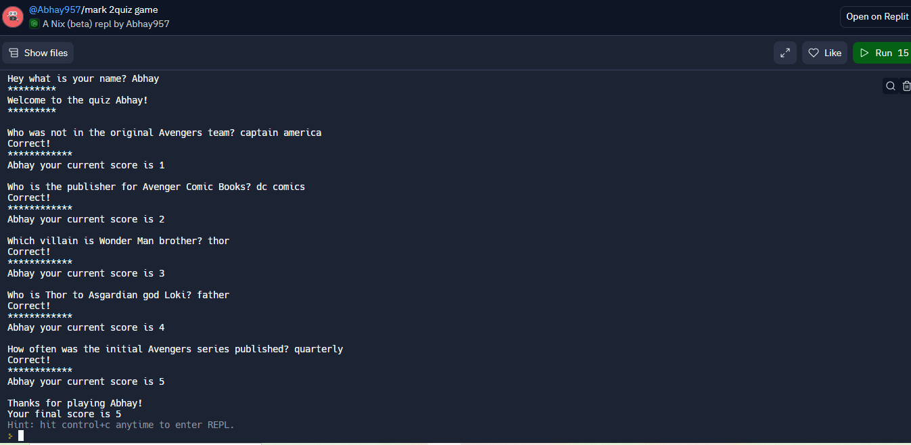

# "Fandom quiz on Marvels"

<h2>Tech stack:</h2>
A CLI app made with nodejs in repl.it .

<h2>About project:</h2>
This project was made as part of level zero of neogcamp.

"Fandom quiz on Marvels" The quiz consists of 5 questions about avengers.

For each correct answer you get one point which will be added to your final score.

For an incorrect answer you get zero point and also you get to know the correct answer of that question.

Final score is shown at the end.

<h2>CLI app look:</h2>

